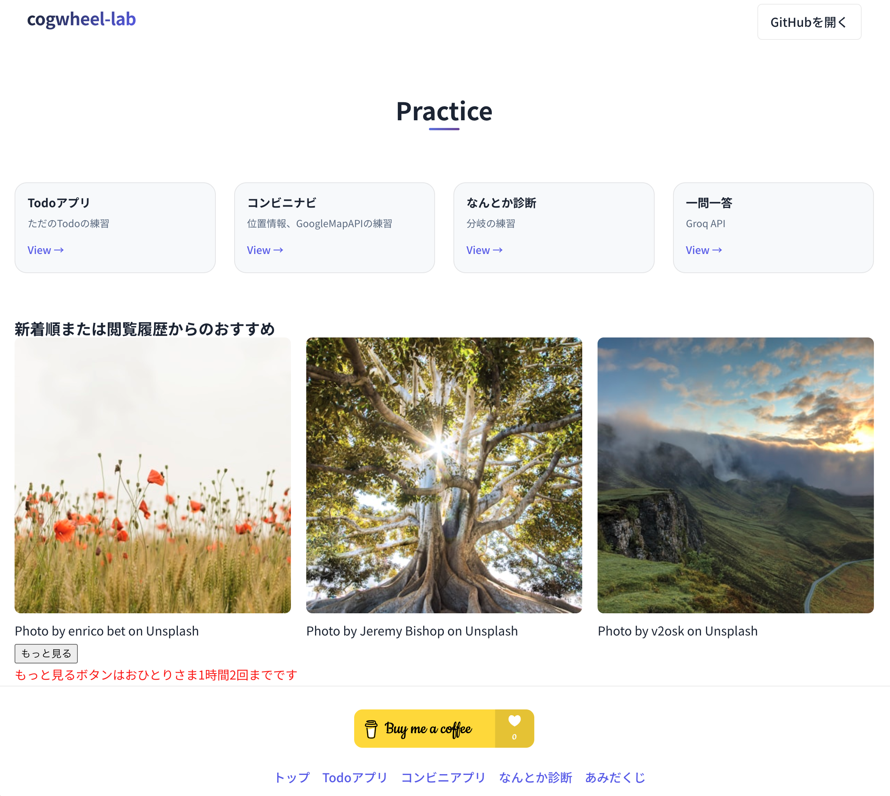
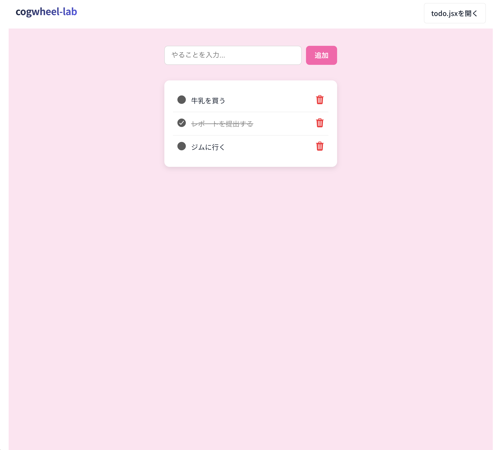

# Portfolio 2026

ポートフォリオサイト

🔗 [デモを見る](https://portfolio-plum-ten-31.vercel.app/)

## 概要

React/Next.jsの学習を目的としたポートフォリオサイトです。

## スクリーンショット

## 使用技術

- フロント: Next.js, React, SCSS
- API: Unsplash API
- その他: localStorage

## 主な機能

- ✅ 制作物一覧の表示
- ✅ Unsplash APIによる画像ギャラリー
- ✅ 「もっと見る」ボタンで画像を追加読み込み（最大3ページまで）
- ✅ localStorageによるボタンクリック回数の記録（1時間2回まで）

## 工夫した点

- useEffectによるページ変更時のAPI連携
- localStorageでクリックデータをJSON形式で永続化
- Unsplash画像の動的リサイズ（クエリパラメータ）
