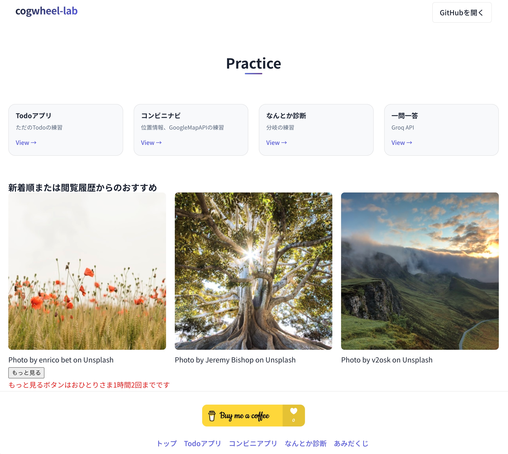
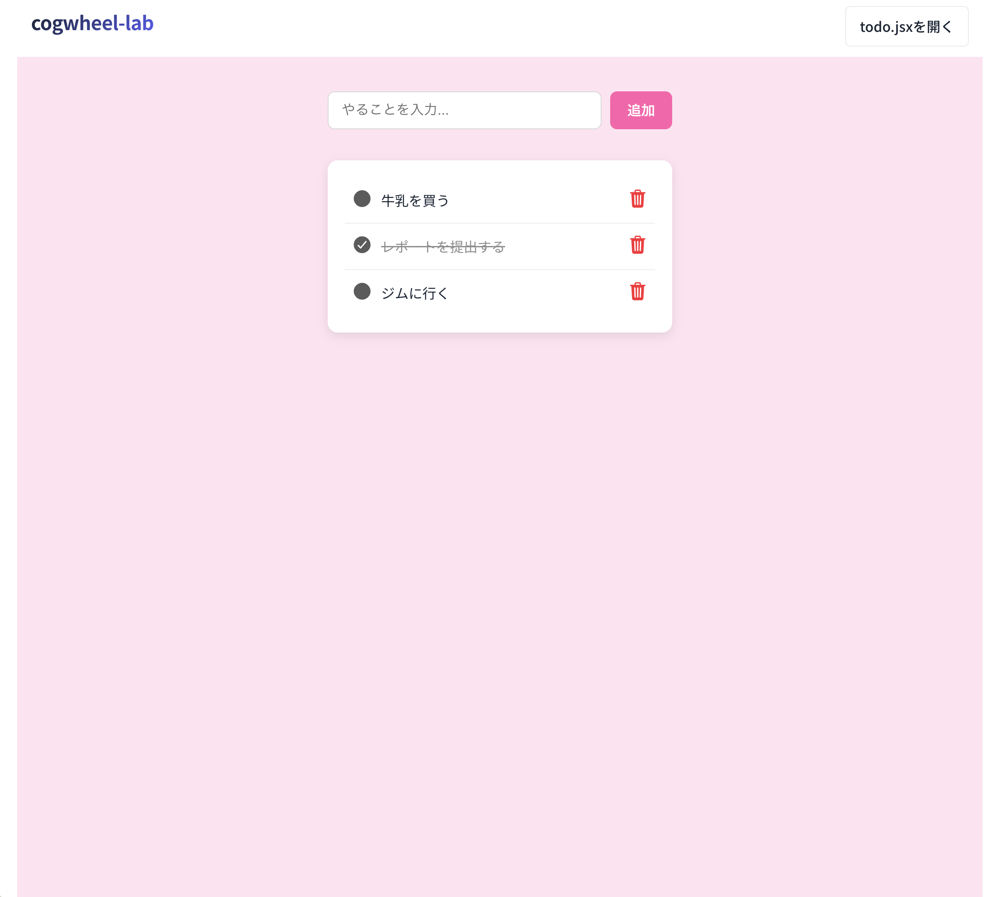

# ポートフォリオサイト

🔗 [デモを見る](https://portfolio-plum-ten-31.vercel.app/)

## 概要

React/Next.jsの学習を目的としたポートフォリオサイトです。

## スクリーンショット

## 使用技術

- フロント: Next.js, React, SCSS
- API: Unsplash API
- その他: localStorage

## 主な機能

- ✅ 制作物一覧の表示
- ✅ Unsplash APIによる画像ギャラリー
- ✅ 「もっと見る」ボタンで画像を追加読み込み（最大3ページまで）
- ✅ localStorageによるボタンクリック回数の記録（1時間2回まで）

## 工夫した点

- useEffectによるページ変更時のAPI連携
- localStorageでクリックデータをJSON形式で永続化
- Unsplash画像の動的リサイズ（クエリパラメータ）

---

# その他の活動

## TimeGuard
特定サイトの閲覧時間を制限するChrome拡張機能
🔗 [Chromeウェブストアで見る](https://chromewebstore.google.com/detail/timeguard/jkeakohkijffkacpkdkgfgihmbempclj)
### 概要
サイトの見すぎを防ぐことを目的としたChrome拡張機能です。
### 使用技術
- フロント: HTML, CSS, JavaScript
- その他: localStorage
### 主な機能
- ✅ ドメイン・パス単位での閲覧時間制限
- ✅ アクティブなタブのみを精密に計測
- ✅ データはローカル保存のみ
